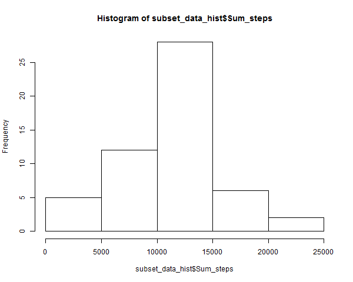
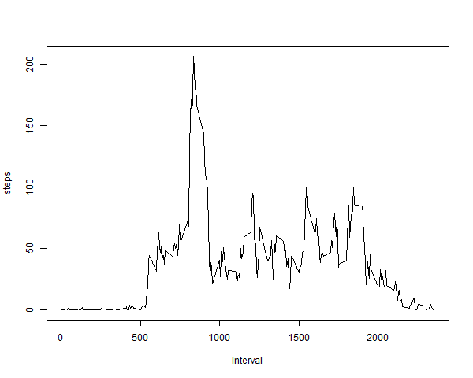
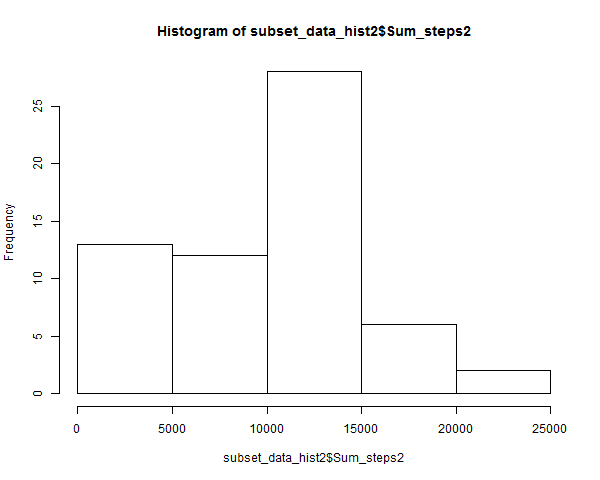
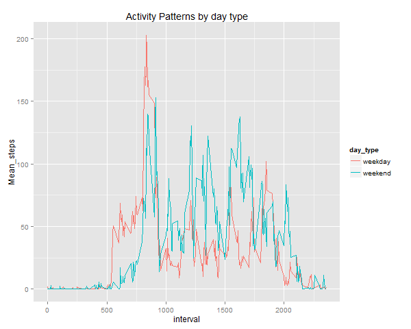

<br>
<br>

## Coursera Reproducible Peer Assignment 1 coal
The coal of this exercise is to get familiar with that concept at all research
should document in that level at anyone can reproduce it and check if one can 
end up to the same result.
Other coal is use [literate programming](http://www.literateprogramming.com/)
using R and [markdown](http://en.wikipedia.org/wiki/Markdown)

##Research of the Assignment

[Below * means at the section is from the original assignment introduction](https://github.com/rdpeng/RepData_PeerAssessment1)

*It is now possible to collect a large amount of data about personal
movement using activity monitoring devices such as a
[Fitbit](http://www.fitbit.com), [Nike
Fuelband](http://www.nike.com/us/en_us/c/nikeplus-fuelband), or
[Jawbone Up](https://jawbone.com/up). These type of devices are part of
the "quantified self" movement -- a group of enthusiasts who take
measurements about themselves regularly to improve their health, to
find patterns in their behavior, or because they are tech geeks. But
these data remain under-utilized both because the raw data are hard to
obtain and there is a lack of statistical methods and software for
processing and interpreting the data.

This assignment makes use of data from a personal activity monitoring
device. This device collects data at 5 minute intervals through out the
day. The data consists of two months of data from an anonymous
individual collected during the months of October and November, 2012
and include the number of steps taken in 5 minute intervals each day.*


### Loading and preprocessing the data

*The data for this assignment can be downloaded from the course web site:

Dataset: Activity monitoring data [52K]
The variables included in this dataset are:

steps: Number of steps taking in a 5-minute interval (missing values are coded as NA)

date: The date on which the measurement was taken in YYYY-MM-DD format

interval: Identifier for the 5-minute interval in which measurement was taken

The dataset is stored in a comma-separated-value (CSV) file and there are a total of 17,568 observations in this dataset.

Data will load from coursera Reproducible course site in working directory.*

Data is downloaded 2014.12.08 (yyyy.mm.dd)
Because data came with clone of course BitHub repository next download not in use. If you need it please uncomment this code chunk.
```{r}
#url <- "https://d396qusza40orc.cloudfront.net/repdata%2Fdata%2Factivity.zip"
#download.file(url, file.path(getwd(), "Factivity.zip"))

```
Next zip packet will unzip to read data in the dta 
```{r}
unzip("Factivity.zip")
dta <- read.table("activity.csv", header = TRUE, sep = ",")
```

Lookup data
```{r}
str(dta)
summary(dta)

```

We can see there is lots of missing values in steps at least begining of data vector.
Median is O how that can be?

load data.table library in order to handling data effectivily

```{r}
library(data.table)
dta_table_all <- data.table(dta)
```

First given task

### What is mean total number of steps taken per day?

*What is mean total number of steps taken per day?

For this part of the assignment, you can ignore the missing values in the dataset.

Make a histogram of the total number of steps taken each day

Calculate and report the mean and median total number of steps taken per day*

Creating histogram:
First taking out missing values "na" and in order to get total numbers of taken steps per day you can summarize steps in each day in the data table
and finely print out histogram
```{r}
dta_table <- na.omit(dta_table_all)
subset_data_hist <- dta_table[, list(Sum_steps = sum(steps)), by=c("date")]
#just for checking the data
#summary(subset_data_hist)
#str(subset_data_hist)
#head(subset_data_hist)
png("figure/Histogram1.png", height = 480, width = 600)
hist(subset_data_hist$Sum_steps)
dev.off()
#plot(subset_data_hist, freq = Sum_steps)
```
 

Calculating and reporting the mean and median total number of steps taken per day you can use same data table which is already cleaned missed values and calculate mean and median by date
```{r}
#dta_table <- na.omit(dta_table)
subset_data <- dta_table[, list(Mean_steps = mean(steps),
                                Median_steps = median(steps)), by=c("date")]
print(subset_data)

```

Second given task

### What is the average daily activity pattern?

*Make a time series plot (i.e. type = "l") of the 5-minute interval (x-axis) and the average number of steps taken, averaged across all days (y-axis)

Which 5-minute interval, on average across all the days in the dataset, contains the maximum number of steps?*

Creating Activity Pattern time series plot 
```{r}
png("figure/activity_pattern.png", height = 480, width = 600)
activity_pattern <- aggregate(steps ~ interval, data = dta_table, FUN = mean)
plot(activity_pattern, type = "l")
dev.off()
```
 

Maximum steps taken in interval

```{r}
dta_table[which.max(dta_table$steps),]
```

third given task

### Imputing missing values

*Note that there are a number of days/intervals where there are missing values (coded as NA). The presence of missing days may introduce bias into some calculations or summaries of the data.

Calculate and report the total number of missing values in the dataset (i.e. the total number of rows with NAs)

Devise a strategy for filling in all of the missing values in the dataset. The strategy does not need to be sophisticated. For example, you could use the mean/median for that day, or the mean for that 5-minute interval, etc.

Create a new dataset that is equal to the original dataset but with the missing data filled in.

Make a histogram of the total number of steps taken each day and Calculate and report the mean and median total number of steps taken per day. Do these values differ from the estimates from the first part of the assignment? What is the impact of imputing missing data on the estimates of the total daily number of steps?*

Missing values (na) replacement stragecy:
We have already calculated median for each day so we use that daily mean to replace na.

Calculating na rows. Because we have data tables with and without na we can simple subtract all rows data table 
Total number of missing values "na" rows is
```{r}
nrow(dta_table_all)-nrow(dta_table)
```


We are using already calculated daily mean to replace "na" values.
Firs we join original all rows data (dta_table_all) and mean table (subset_data). Joining method is all.x=T because otherwise we lost those lines which have not mean for that day.

```{r}
#merge_data<-merge(dta_table_all,subset_data, by="date")
merge_data<-merge(dta_table_all,subset_data, by="date",all.x=T)

#just for looking at data seems to be ok
#head(merge_data, 300)
str(merge_data)
summary(merge_data)

```

Second step is replase steps "na" with Mean_steps value and finally we take subset from table which is similar than original exept there is "na"s replaced

```{r}
data_na_imputed <-merge_data[,steps:=
                        {ifelse(is.na(merge_data$Mean_steps),0,
                        ifelse(is.na(merge_data$steps),
                        merge_data$Mean_steps,
                        merge_data$steps))}]
#take away un necessary columns to get original look for data.table
data_na_imputed$Mean_steps<-NULL
data_na_imputed$Median_steps<-NULL
summary(data_na_imputed)

```

Creating histogram of all data with na
```{r}
png("figure/Histogram2.png", height = 480, width = 600)
subset_data_hist2 <- data_na_imputed[,
                        list(Sum_steps2 = sum(steps)), by=c("date")]
hist(subset_data_hist2$Sum_steps2)
dev.off()
```

 


Histograms shows that there is more days with relative small amount of steps now than earlier.

Calculating and reporting Mean and Median

```{r}
subset_data2 <- data_na_imputed[, list(Mean_steps = mean(steps),
                                Median_steps = median(steps)), by=c("date")]
print(subset_data2)
```
Per day mean is not changed so much and median not at all.
But when we compare summaries for each data we can see whole column mean is tropped.

```{r}
summary(dta)
summary(data_na_imputed)
```


fourth given task

### Are there differences in activity patterns between weekdays and weekends?

*For this part the `weekdays()` function may be of some help here. Use
the dataset with the filled-in missing values for this part.

1. Create a new factor variable in the dataset with two levels -- "weekday" and "weekend" indicating whether a given date is a weekday or weekend day.

2. Make a panel plot containing a time series plot (i.e. `type = "l"`) of the 5-minute interval (x-axis) and the average number of steps taken, averaged across all weekday days or weekend days (y-axis).*

First we need to add factor variable day_type. We will using weekdays() function to do this.
For some reason I didn't not able to get English language in use.
So the following code works in Finnish language installation.
We you run this you need to change those day names (lauantai = Saturday 
and sunnuntai = Sunday)

```{r}
#Sys.setenv(LANGUAGE="en")

#language = EN

week_day_type <- function(date) {
       # as.POSIXlt(data_na_imputed$date)$wday
       # as.integer(format(data_na_imputed$date, format = '%u'))
         #  weekdays(as.Date(date))
    ifelse (weekdays(as.Date(date)) %in% c("lauantai", "sunnuntai"),
  #  ifelse (weekdays(as.Date(date)) %in% c("Saturday", "Sunday"),
            "weekend","weekday")
    }
data_na_imputed$day_type <- as.factor(sapply(
        data_na_imputed$date, week_day_type))

```

We using gglot to create plot. 
First calculating average for each interval
Second draw a time series plot with to lines.
This helps to compare each activity pattern when graphs are one in the other.

```{r}
library(ggplot2)
subset_data_day_type <- data_na_imputed[, list(Mean_steps = mean(steps)),
                                , by=c("interval","day_type")]
#print(subset_data_day_type)
#str(subset_data_day_type$day_type)

png("figure/ActivityPatterns_DayType.png", height = 480, width = 600)

g<-qplot(interval,Mean_steps, 
           data=subset_data_day_type, 
           color = day_type,
           geom="line",
           main="Activity Patterns by day type")
g
dev.off()      

```

 
