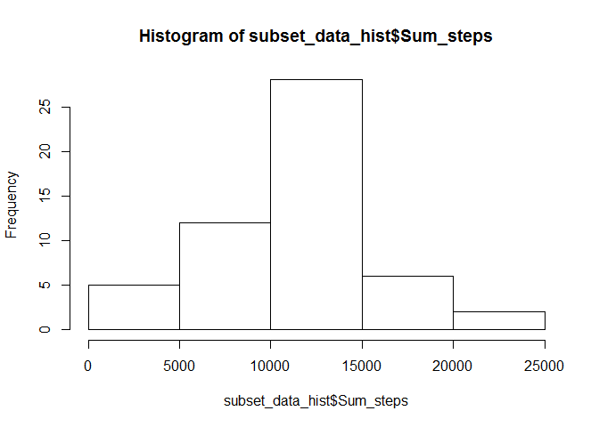
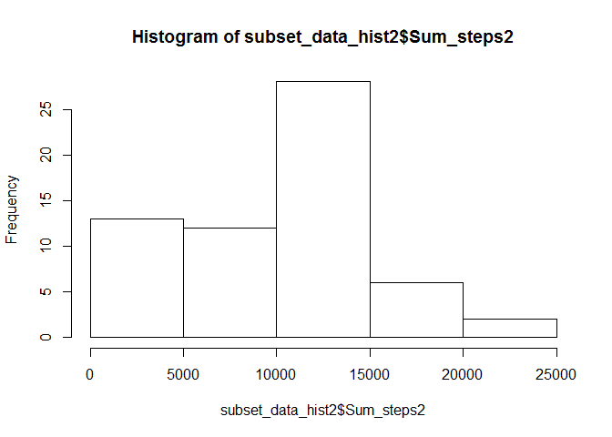
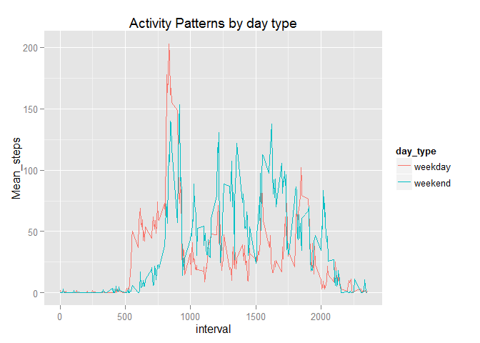

# Reproducible Research: Peer Assignment 1
<br>
<br>

## Coursera Reproducible Peer Assignment 1 coal
The coal of this excercise is to get familiar with that consept at all research
should document in that level at anyone can reproduce it and chech if one can 
end up to the same result.
Other coal is use [literate programming](http://www.literateprogramming.com/)
using R and [markdown](http://en.wikipedia.org/wiki/Markdown)

##Research of the Assignment


### Loading and preprocessing the data
Data

The data for this assignment can be downloaded from the course web site:

Dataset: Activity monitoring data [52K]
The variables included in this dataset are:

steps: Number of steps taking in a 5-minute interval (missing values are coded as NA)

date: The date on which the measurement was taken in YYYY-MM-DD format

interval: Identifier for the 5-minute interval in which measurement was taken

The dataset is stored in a comma-separated-value (CSV) file and there are a total of 17,568 observations in this dataset.

Data will load from coursera Reproducible course site in working directory.
Data is downloaded 2014.12.08 (yyyy.mm.dd)

```r
url <- "https://d396qusza40orc.cloudfront.net/repdata%2Fdata%2Factivity.zip"
#download.file(url, file.path(getwd(), "Factivity.zip"))
```
Next zip packet will unzip to read data in the

```r
unzip("Factivity.zip")
dta <- read.table("activity.csv", header = TRUE, sep = ",")
```

Lookup data

```r
str(dta)
```

```
## 'data.frame':	17568 obs. of  3 variables:
##  $ steps   : int  NA NA NA NA NA NA NA NA NA NA ...
##  $ date    : Factor w/ 61 levels "2012-10-01","2012-10-02",..: 1 1 1 1 1 1 1 1 1 1 ...
##  $ interval: int  0 5 10 15 20 25 30 35 40 45 ...
```

```r
summary(dta)
```

```
##      steps                date          interval     
##  Min.   :  0.00   2012-10-01:  288   Min.   :   0.0  
##  1st Qu.:  0.00   2012-10-02:  288   1st Qu.: 588.8  
##  Median :  0.00   2012-10-03:  288   Median :1177.5  
##  Mean   : 37.38   2012-10-04:  288   Mean   :1177.5  
##  3rd Qu.: 12.00   2012-10-05:  288   3rd Qu.:1766.2  
##  Max.   :806.00   2012-10-06:  288   Max.   :2355.0  
##  NA's   :2304     (Other)   :15840
```


load data.table library in order to handling data effectivily


```r
library(data.table)
dta_table_all <- data.table(dta)
```

First given task

### What is mean total number of steps taken per day?

What is mean total number of steps taken per day?

For this part of the assignment, you can ignore the missing values in the dataset.

Make a histogram of the total number of steps taken each day

Calculate and report the mean and median total number of steps taken per day

Creating histogram
First taking out missing values "na" and in order to get total numbers of taken steps per day you can summarize steps in each day in the data table
and finely print out histogram

```r
dta_table <- na.omit(dta_table_all)
subset_data_hist <- dta_table[, list(Sum_steps = sum(steps)), by=c("date")]
summary(subset_data_hist)
```

```
##          date      Sum_steps    
##  2012-10-02: 1   Min.   :   41  
##  2012-10-03: 1   1st Qu.: 8841  
##  2012-10-04: 1   Median :10765  
##  2012-10-05: 1   Mean   :10766  
##  2012-10-06: 1   3rd Qu.:13294  
##  2012-10-07: 1   Max.   :21194  
##  (Other)   :47
```

```r
str(subset_data_hist)
```

```
## Classes 'data.table' and 'data.frame':	53 obs. of  2 variables:
##  $ date     : Factor w/ 61 levels "2012-10-01","2012-10-02",..: 2 3 4 5 6 7 9 10 11 12 ...
##  $ Sum_steps: int  126 11352 12116 13294 15420 11015 12811 9900 10304 17382 ...
##  - attr(*, ".internal.selfref")=<externalptr>
```

```r
head(subset_data_hist)
```

```
##          date Sum_steps
## 1: 2012-10-02       126
## 2: 2012-10-03     11352
## 3: 2012-10-04     12116
## 4: 2012-10-05     13294
## 5: 2012-10-06     15420
## 6: 2012-10-07     11015
```

```r
hist(subset_data_hist$Sum_steps)
```

 

```r
#plot(subset_data_hist, freq = Sum_steps)
```


Calculating and reportimg the mean and median total number of steps taken per day you can use same data table which is already cleaned missed values and calculate mean and median by date

```r
#dta_table <- na.omit(dta_table)
subset_data <- dta_table[, list(Mean_steps = mean(steps),
                                Median_steps = median(steps)), by=c("date")]
print(subset_data)
```

```
##           date Mean_steps Median_steps
##  1: 2012-10-02  0.4375000            0
##  2: 2012-10-03 39.4166667            0
##  3: 2012-10-04 42.0694444            0
##  4: 2012-10-05 46.1597222            0
##  5: 2012-10-06 53.5416667            0
##  6: 2012-10-07 38.2465278            0
##  7: 2012-10-09 44.4826389            0
##  8: 2012-10-10 34.3750000            0
##  9: 2012-10-11 35.7777778            0
## 10: 2012-10-12 60.3541667            0
## 11: 2012-10-13 43.1458333            0
## 12: 2012-10-14 52.4236111            0
## 13: 2012-10-15 35.2048611            0
## 14: 2012-10-16 52.3750000            0
## 15: 2012-10-17 46.7083333            0
## 16: 2012-10-18 34.9166667            0
## 17: 2012-10-19 41.0729167            0
## 18: 2012-10-20 36.0937500            0
## 19: 2012-10-21 30.6284722            0
## 20: 2012-10-22 46.7361111            0
## 21: 2012-10-23 30.9652778            0
## 22: 2012-10-24 29.0104167            0
## 23: 2012-10-25  8.6527778            0
## 24: 2012-10-26 23.5347222            0
## 25: 2012-10-27 35.1354167            0
## 26: 2012-10-28 39.7847222            0
## 27: 2012-10-29 17.4236111            0
## 28: 2012-10-30 34.0937500            0
## 29: 2012-10-31 53.5208333            0
## 30: 2012-11-02 36.8055556            0
## 31: 2012-11-03 36.7048611            0
## 32: 2012-11-05 36.2465278            0
## 33: 2012-11-06 28.9375000            0
## 34: 2012-11-07 44.7326389            0
## 35: 2012-11-08 11.1770833            0
## 36: 2012-11-11 43.7777778            0
## 37: 2012-11-12 37.3784722            0
## 38: 2012-11-13 25.4722222            0
## 39: 2012-11-15  0.1423611            0
## 40: 2012-11-16 18.8923611            0
## 41: 2012-11-17 49.7881944            0
## 42: 2012-11-18 52.4652778            0
## 43: 2012-11-19 30.6979167            0
## 44: 2012-11-20 15.5277778            0
## 45: 2012-11-21 44.3993056            0
## 46: 2012-11-22 70.9270833            0
## 47: 2012-11-23 73.5902778            0
## 48: 2012-11-24 50.2708333            0
## 49: 2012-11-25 41.0902778            0
## 50: 2012-11-26 38.7569444            0
## 51: 2012-11-27 47.3819444            0
## 52: 2012-11-28 35.3576389            0
## 53: 2012-11-29 24.4687500            0
##           date Mean_steps Median_steps
```


Second given task

### What is the average daily activity pattern?

Make a time series plot (i.e. type = "l") of the 5-minute interval (x-axis) and the average number of steps taken, averaged across all days (y-axis)

Which 5-minute interval, on average across all the days in the dataset, contains the maximum number of steps?

Creating time series plot

```r
activity_pattern <- aggregate(steps ~ interval, data = dta_table, FUN = mean)
plot(activity_pattern, type = "l")
```

 

Maximun steps taken in interval

```r
dta_table[which.max(dta_table$steps),]
```

```
##    steps       date interval
## 1:   806 2012-11-27      615
```

thrird given task

### Imputing missing values
Note that there are a number of days/intervals where there are missing values (coded as NA). The presence of missing days may introduce bias into some calculations or summaries of the data.

Calculate and report the total number of missing values in the dataset (i.e. the total number of rows with NAs)

Devise a strategy for filling in all of the missing values in the dataset. The strategy does not need to be sophisticated. For example, you could use the mean/median for that day, or the mean for that 5-minute interval, etc.

Create a new dataset that is equal to the original dataset but with the missing data filled in.

Make a histogram of the total number of steps taken each day and Calculate and report the mean and median total number of steps taken per day. Do these values differ from the estimates from the first part of the assignment? What is the impact of imputing missing data on the estimates of the total daily number of steps?

Calculating na rows. Because we have data tables with and without na we can simple subract all rows data table 
Total number of missing values "na" rows is

```r
nrow(dta_table_all)-nrow(dta_table)
```

```
## [1] 2304
```


We using already calculated dayly mean to replace "na" values.
Firs we join original all rows data (dta_table_all) and mean table (subset_data)
Second step is replase steps "na" with Mean_steps value and finally we take subset from table which is similar than original exept there is "na"s replaced

```r
merge_data<-merge(dta_table_all,subset_data, by="date",all.x=T)

#merge_data<-merge(dta_table_all,subset_data, by="date")
head(merge_data, 300)
```

```
##            date steps interval Mean_steps Median_steps
##   1: 2012-10-01    NA        0         NA           NA
##   2: 2012-10-01    NA        5         NA           NA
##   3: 2012-10-01    NA       10         NA           NA
##   4: 2012-10-01    NA       15         NA           NA
##   5: 2012-10-01    NA       20         NA           NA
##  ---                                                  
## 296: 2012-10-02     0       35     0.4375            0
## 297: 2012-10-02     0       40     0.4375            0
## 298: 2012-10-02     0       45     0.4375            0
## 299: 2012-10-02     0       50     0.4375            0
## 300: 2012-10-02     0       55     0.4375            0
```

```r
str(merge_data)
```

```
## Classes 'data.table' and 'data.frame':	17568 obs. of  5 variables:
##  $ date        : Factor w/ 61 levels "2012-10-01","2012-10-02",..: 1 1 1 1 1 1 1 1 1 1 ...
##  $ steps       : int  NA NA NA NA NA NA NA NA NA NA ...
##  $ interval    : int  0 5 10 15 20 25 30 35 40 45 ...
##  $ Mean_steps  : num  NA NA NA NA NA NA NA NA NA NA ...
##  $ Median_steps: num  NA NA NA NA NA NA NA NA NA NA ...
##  - attr(*, ".internal.selfref")=<externalptr> 
##  - attr(*, "sorted")= chr "date"
```

```r
summary(merge_data)
```

```
##          date           steps           interval        Mean_steps     
##  2012-10-01:  288   Min.   :  0.00   Min.   :   0.0   Min.   : 0.1424  
##  2012-10-02:  288   1st Qu.:  0.00   1st Qu.: 588.8   1st Qu.:30.6979  
##  2012-10-03:  288   Median :  0.00   Median :1177.5   Median :37.3785  
##  2012-10-04:  288   Mean   : 37.38   Mean   :1177.5   Mean   :37.3826  
##  2012-10-05:  288   3rd Qu.: 12.00   3rd Qu.:1766.2   3rd Qu.:46.1597  
##  2012-10-06:  288   Max.   :806.00   Max.   :2355.0   Max.   :73.5903  
##  (Other)   :15840   NA's   :2304                      NA's   :2304     
##   Median_steps 
##  Min.   :0     
##  1st Qu.:0     
##  Median :0     
##  Mean   :0     
##  3rd Qu.:0     
##  Max.   :0     
##  NA's   :2304
```

```r
#dta_table_all_na_replaced<-merge_data[,steps:=mean(Mean_steps),by=date]
#for (col = "steps" y[is.na(get(col)), (col) := 0]
  
#dta_table_all_na_replaced <- merge_data[is.na(x[1:2])]<-0
#merge_data[, ]

data_na_imputed <-merge_data[,steps:=
                        {ifelse(is.na(merge_data$Mean_steps),0,
                        ifelse(is.na(merge_data$steps),
                        merge_data$Mean_steps,
                        merge_data$steps))}]
data_na_imputed$Mean_steps<-NULL
data_na_imputed$Median_steps<-NULL
summary(data_na_imputed)
```

```
##          date           steps           interval     
##  2012-10-01:  288   Min.   :  0.00   Min.   :   0.0  
##  2012-10-02:  288   1st Qu.:  0.00   1st Qu.: 588.8  
##  2012-10-03:  288   Median :  0.00   Median :1177.5  
##  2012-10-04:  288   Mean   : 32.48   Mean   :1177.5  
##  2012-10-05:  288   3rd Qu.:  0.00   3rd Qu.:1766.2  
##  2012-10-06:  288   Max.   :806.00   Max.   :2355.0  
##  (Other)   :15840
```

```r
#data_na_imputed<-merge_data[,c(x,date,interval)]
#summary(data_na_imputed)

#setnames(data_na_imputed, "x", "steps")

subset_data_hist2 <- data_na_imputed[,
                        list(Sum_steps2 = sum(steps)), by=c("date")]
hist(subset_data_hist2$Sum_steps2)
```

 

```r
#merge_data$steps[is.na(merge_data2$steps)] <- 0
#merge_data_na <- is.na(merge_data$steps)
#activity$steps[nas] <- activity$steps.y[nas]
#activity <- activity[, c(1:3)]


subset_data2 <- data_na_imputed[, list(Mean_steps = mean(steps),
                                Median_steps = median(steps)), by=c("date")]

print(subset_data2)
```

```
##           date Mean_steps Median_steps
##  1: 2012-10-01  0.0000000            0
##  2: 2012-10-02  0.4375000            0
##  3: 2012-10-03 39.4166667            0
##  4: 2012-10-04 42.0694444            0
##  5: 2012-10-05 46.1597222            0
##  6: 2012-10-06 53.5416667            0
##  7: 2012-10-07 38.2465278            0
##  8: 2012-10-08  0.0000000            0
##  9: 2012-10-09 44.4826389            0
## 10: 2012-10-10 34.3750000            0
## 11: 2012-10-11 35.7777778            0
## 12: 2012-10-12 60.3541667            0
## 13: 2012-10-13 43.1458333            0
## 14: 2012-10-14 52.4236111            0
## 15: 2012-10-15 35.2048611            0
## 16: 2012-10-16 52.3750000            0
## 17: 2012-10-17 46.7083333            0
## 18: 2012-10-18 34.9166667            0
## 19: 2012-10-19 41.0729167            0
## 20: 2012-10-20 36.0937500            0
## 21: 2012-10-21 30.6284722            0
## 22: 2012-10-22 46.7361111            0
## 23: 2012-10-23 30.9652778            0
## 24: 2012-10-24 29.0104167            0
## 25: 2012-10-25  8.6527778            0
## 26: 2012-10-26 23.5347222            0
## 27: 2012-10-27 35.1354167            0
## 28: 2012-10-28 39.7847222            0
## 29: 2012-10-29 17.4236111            0
## 30: 2012-10-30 34.0937500            0
## 31: 2012-10-31 53.5208333            0
## 32: 2012-11-01  0.0000000            0
## 33: 2012-11-02 36.8055556            0
## 34: 2012-11-03 36.7048611            0
## 35: 2012-11-04  0.0000000            0
## 36: 2012-11-05 36.2465278            0
## 37: 2012-11-06 28.9375000            0
## 38: 2012-11-07 44.7326389            0
## 39: 2012-11-08 11.1770833            0
## 40: 2012-11-09  0.0000000            0
## 41: 2012-11-10  0.0000000            0
## 42: 2012-11-11 43.7777778            0
## 43: 2012-11-12 37.3784722            0
## 44: 2012-11-13 25.4722222            0
## 45: 2012-11-14  0.0000000            0
## 46: 2012-11-15  0.1423611            0
## 47: 2012-11-16 18.8923611            0
## 48: 2012-11-17 49.7881944            0
## 49: 2012-11-18 52.4652778            0
## 50: 2012-11-19 30.6979167            0
## 51: 2012-11-20 15.5277778            0
## 52: 2012-11-21 44.3993056            0
## 53: 2012-11-22 70.9270833            0
## 54: 2012-11-23 73.5902778            0
## 55: 2012-11-24 50.2708333            0
## 56: 2012-11-25 41.0902778            0
## 57: 2012-11-26 38.7569444            0
## 58: 2012-11-27 47.3819444            0
## 59: 2012-11-28 35.3576389            0
## 60: 2012-11-29 24.4687500            0
## 61: 2012-11-30  0.0000000            0
##           date Mean_steps Median_steps
```


### Are there differences in activity patterns between weekdays and weekends?


```r
Sys.setenv(LANGUAGE="en")

week_day_type <- function(date) {
       # as.POSIXlt(data_na_imputed$date)$wday
       # as.integer(format(data_na_imputed$date, format = '%u'))
         #  weekdays(as.Date(date))
    ifelse (weekdays(as.Date(date)) %in% c("lauantai", "sunnuntai"),
  #  ifelse (weekdays(as.Date(date)) %in% c("Saturday", "Sunday"),
            "weekend","weekday")
    }
data_na_imputed$day_type <- as.factor(sapply(
        data_na_imputed$date, week_day_type))


subset_data_day_type <- data_na_imputed[, list(Mean_steps = mean(steps)),
                                , by=c("interval","day_type")]
#print(subset_data_day_type)
#str(subset_data_day_type$day_type)
library(ggplot2)
```

```
## Warning: package 'ggplot2' was built under R version 3.1.2
```

```r
png("figure/ActivityPatterns_DayType.png", height = 480, width = 600)

g<-qplot(interval,Mean_steps, 
           data=subset_data_day_type, 
           color = day_type,
           geom="line",
           main="Activity Patterns by day type")
dev.off()      
```

```
## pdf 
##   2
```

```r
g
```

 

